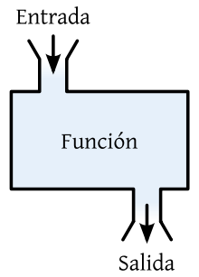
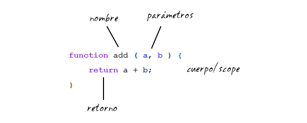
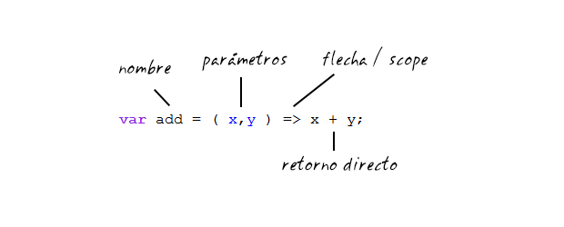
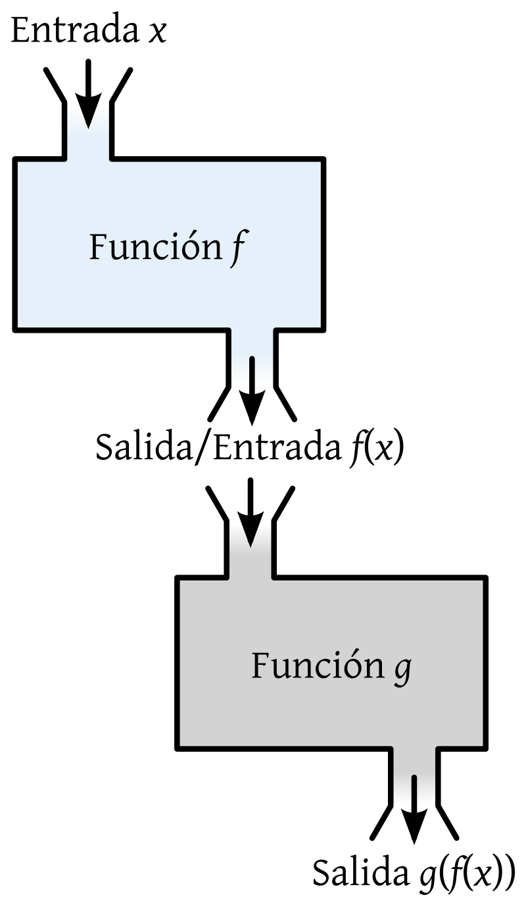

# Funciones

Las funciones son los bloques de construcción de los programas informáticos,como los ladrillos para una casa.

Las funciones te ayudan a organizar tu código, reutilizar la funcionalidad, y pensar sobre un problema en piezas más pequeñas.

Una funcion se ve como una caja negra,donde ingresan datos y salen otros.Esto aisla la implementación y me permite reutilizar,es decir, que no me importa como este hecho por dentro si cumple su funcion de forma correcta me permite facilitar mi tarea y puedo usarlo cuantas veces quieras.
Nosotros podemos hacer nuestra libreria de funciones o usar una de tercero.Para no estar escribiendo la logica en cada momento. Si exite la rueda no la reinventemos ,solo hay que usarla.



Una funcion debe hacer una sola cosa y bien,este principio me asegura la usabilidad y me evita errores.

## Funciones en javascript

En javascript tenemos dos formas de escribir funciones

antes(ES5):


    function nombreFuncion(parametros){
      micodigo
      return(para devolver un valor) 
    }


despues(ES6):

aclaracion se escribe con const en vez de var

    const nombreFuncion = (parametros) => {
        micodigo
        return
    }

### Partes

* Nombre: Es el que se utiliza para invocar, llamar o usar(son diferentes formas de decir)
* Cuerpo/Scope: Es el donde va lo el codigo que realiza mi funcion esta es independiente al resto,su variables solo son usables dentro de esta.Fuera de esta no existen. 
* Parametros: Son las entradas a mi funcion, son la variables que se utilizan para realizar un calculo en mi funcion.Puede no contener ninguna o infinitas.Lo recomendadados es que sea la menor cantidad y como mucho 3. Y por ultimo importan en el orden que se coloquen
* Retorno: es el resultado del calculo que voy a devolver.Este me sirve para seguir trabajando o hacer calculos

---

Ej: Se necesita una funcion que me retorne true o false si un usuario ingresa un usuario y clave correcta

```javascript
const login = (user,pass) =>{
  if(user == "admin" || pass == 123456){
    return true;
  }else{
    return false;
  }
}
```

Se puede hacer mas sintetico

```javascript
const login = (user,pass) =>{
  // Si entra al if retorna true cortando el flujo sino retorna false
  if(user == "admin" || pass == 123456){
    return true;
  }
  return false;
}
```

Mas sintetico

```javascript
const login = (user,pass) =>{
  // user == "admin" || pass == 123456 esto es un comparacion logica por lo que me va dar como resultado un booleano
  return user == "admin" || pass == 123456
}
```

En un linea porfa

```javascript
// cuando es una sola instrucion no hace falta colocar el return ni las llaves, ya que el return esta implicito.
// Ojo esto se va entender bien cuando manejen bien funciones
const login = (user,pass) => user == "admin" || pass == 123456
```

---
Ej2: Se necesita una function dado un nombre y apellido me responda con un mensaje personalizado de bienvenida.

```javascript
const createMessage = (name ,lastName) => {
  return `Hola ${name} ${lastName},Bienvenido`
}
```

Es lo mismo pero en una linea

```javascript
const createMessage = (name ,lastName) => `Hola ${name} ${lastName},Bienvenido`

```
---
### Utilizacion de funciones:
Para utilizar una funcion,o como se dice en la jerga invocar o llamar debemos hacer lo siguiente:

nombreDeFuncion(parametros);

ej:
```javascript
const imprimirSaludo = (nombre) => {
  alert(`hola ${nombre}`);
}

imprimirSaludo("Matias");
```

Si tiene un return y queremos guardar lo que tiene hacemos asi

let variable = nombreDeFuncion(parametros);

```javascript
const generarSaludo = (nombre) => {
  return `hola ${nombre}`;
}

let saludo = generarSaludo("Matias");
alert(saludo);
console.log(saludo);
```

recorda que es importante el orden en que estan los parametros

```javascript
const generarSaludo = (nombre,apellido) => {
  return `hola humano con nombre: ${nombre} y apellido: ${apellido}`;
}

let saludo = generarSaludo("Matias","Benary");
alert(saludo);
console.log(saludo);
//esto va a mostrar el siguiente mensaje: hola humano con nombre: Matias y apellido: Benary

let saludo2 = generarSaludo("Benary","Matias");
alert(saludo);
console.log(saludo);
//esto va a mostrar el siguiente mensaje: hola humano con nombre: Benary y apellido: Matias

```
---

### Reutilizacion de funciones

La magia de la funciones se da cuando puedo conectar funciones para que haga resuelva un problema. Para esto la salida de una funcion la puedo conectar a la entrada de la otra


ej1 - parte 1: Se calcular el precio final de un producto,para esto necesito un funcion que le pase como parametro un precio y me retorne el precio final

```javascript
const calcularPrecioFinal = (item) => {
 const DESCUENTO = 0.8 // esto es un descuento del 20% 
 const IMPUESTOS = 1.6 // esto es un impuesto del 25%
 return (item*DESCUENTO)*IMPUESTOS
}

console.log(calcularPrecionFinal(10)) //imprime 12,8

```

ej1 - parte 2: Se generar un ticket que mueste el nombre y el precio final del producto,para esto necesito un funcion que le pase como parametro un precio y me retorne el mensaje en un formato adecuado

```javascript
const generarMensajeItem = (nombre,precio) => {
  return `${nombre} sale $${precio}`
}
// Si lo quieren en un linea seria asi:
//const generarMensajeItem = (nombre,precio) => `${nombre} sale $${precio}`


console.log(generarMensajeItem("papel",10)) // imprime papel sale $10
```

ej1 - parte 3: Ahora se necesita un programa que muestre el ticket de compra del cliente con los precio finales

```javascript
const generarMensajeItem = (nombre,precio) => {
  return `${nombre} sale $${precio}`
}

const calcularPrecioFinal = (item) => {
 const DESCUENTO = 0.8 // esto es un descuento del 20% 
 const IMPUESTOS = 1.6 // esto es un impuesto del 25%
 return (item*DESCUENTO)*IMPUESTOS
}

const papelPrecioFinal = calcularPrecioFinal(10)
console.log(generarMensajeItem("papel",papelPrecioFinal)) // imprime papel sale $12.8

// otra forma de escribir escribir

console.log(generarMensajeItem("lapicera",calcularPrecioFinal(15))) //imprime lapicera sale $19.200000000000003

```

como js lee esto:

    console.log(generarMensajeItem("lapicera",calcularPrecioFinal(15)))

    1.Se fija que tiene que imprimir algo pero primero tiene que resolver generarMensajeItem
    2.Cuando ve generarMensajeItem,el primer parametro esta bien,pero el segundo parametro se tiene que resolver antes de seguir
    3.Se ejecuta calcularPrecioFinal,lo parametro son variables asi que no tiene que resolver nada y se ejecuta
    4.calcularPrecioFinal hace la cuenta y retorna 19.200000000000003
    5.ahora generarMensajeItem tiene los parametro completos,el primero es "lapicera" y el segundo es 19.200000000000003
    6.generarMensajeItem se ejecuta y retorna el mensaje  lapicera sale $19.200000000000003
    7.el console.log tiene como parametro un string que dice
     lapicera sale $19.200000000000003,como es valido lo resuelve y en patanlla muestra el mensaje